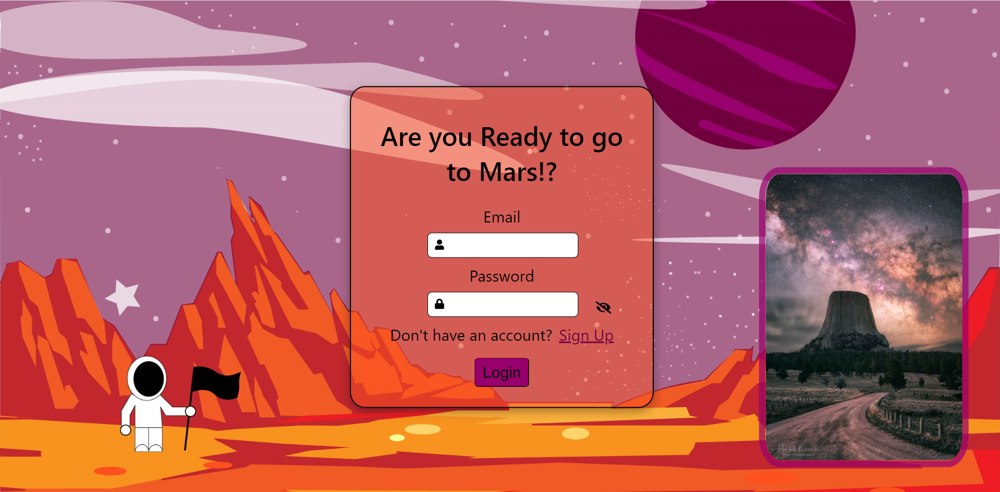

# Mars Travel App :earth_americas: :volcano: :rocket:

If you wonder what the future for space travel might be like, this app might give you a sneak peak. The Mars Travel App is a fun app for what it might be like if you wanted to take a trip to Mars. In this App you can pick your own suit, your own location, and make sure you have the proper "Vaccinations" before you leave! After you've chosen all of your preferences you can view and print your boarding pass!

We hope you enjoy your trip to Mars!!

## This project is written with:

Heroku\
PostgreSQL\
SQL\
React\
TypeScript\
CSS\
HTML

## Get Started by running `npm install`

This project uses several node modules, you'll need them for the full "_experience_"

In the project directory, you can run:

## `npm start`

# Contributors

[sudhasew](https://github.com/sudhasew)\
[ramirolynch](https://github.com/ramirolynch)\
[lavendermoose](https://github.com/lavendermoose)

## Screenshots

